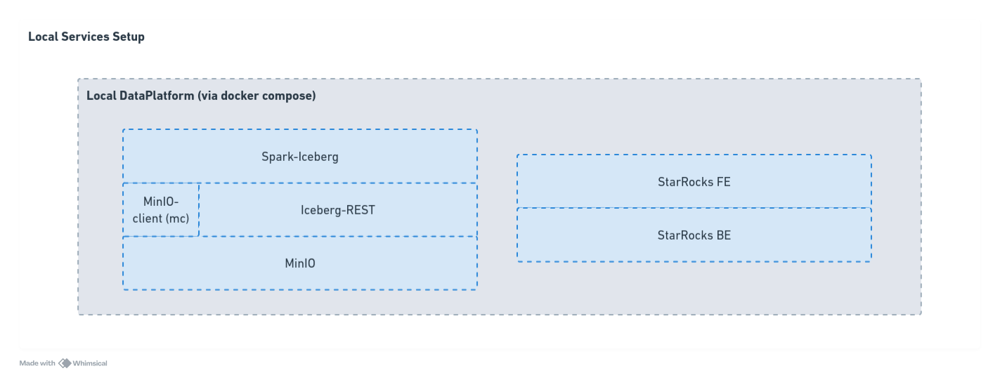

# Experimentation Journal: Define `dbt` sources for externally managed `iceberg` tables in `starrocks`

## Experiment Metadata
- **Date Initiated:** 2025-02-03
- **Date Completed:** 2025-02-04
- **Related Issue number(s):** 
  - https://d3b.atlassian.net/browse/SJRA-42

## Background and Context

As part of the Radiant project, several key technologies were identified as good candidates to power the data platform.

The experiment therefore as the following constraints: 

- Use `dbt` to transform data.
- Use StarRocks as the data warehouse technology. 
- Leverage external Iceberg as the data lake format.

## Problem Statement

**Problem:**
- **Q1**: Can we use an Iceberg table (external catalog), federated by StarRocks, as a source in `dbt` ? 
- **Q2**: Can materialization for those sources be both as `view` and `table` ?

## Experiment Design

### Methodology

Given the constraints and context, perform the following: 

1. Identify the source dataset.
2. Load the source data into an Iceberg table. 
3. Run `dbt build` (combination of `run` and `test`) to transform the data and test it.


### Tools and Resources

#### Environment & Tools

The following diagram presents the local experimental setup.
> A `docker-compose.yml` file was used to specify required services. 



The experimental stack is composed of the following tech/tools: 

- `MinIO` (https://min.io/): Distributed object store.
- `Iceberg` (https://iceberg.apache.org/): Open table format.
- `StarRocks` (https://www.starrocks.io/): Analytical data warehouse.
- `dbt` (https://www.getdbt.com/): Data transformation. 
- `python` (https://www.python.org/): Used to build scripts to load/clean the data.

#### Data

Re-use the `dbt` tutorial's [Jaffle Shop data](https://github.com/dbt-labs/jaffle-shop?tab=readme-ov-file#-load-the-data-from-s3) as the raw data to be loaded into Iceberg tables.

We use the following files:

  - `raw_customers.csv`
  - `raw_orders.csv`
  - `raw_payments.csv`

## Observations

Running the experiment produced the following data hierarchy:


Where:
- `iceberg.jaffle_shop` comes from the external catalog 
- `exp001_iceberg_external_sources` is defined as the StarRocks schema

And the following `dbt` relationship graph:


**Logs**:

`dbt run` produced the following logs. 

```
19:28:19  Running with dbt=1.8.9
19:28:19  Registered adapter: starrocks=1.7.0
19:28:20  Found 5 models, 20 data tests, 3 sources, 419 macros
19:28:20  
19:28:20  Concurrency: 1 threads (target='dev')
19:28:20  
19:28:20  1 of 5 START sql view model exp001_iceberg_external_sources.stg_customers ...... [RUN]
19:28:20  1 of 5 OK created sql view model exp001_iceberg_external_sources.stg_customers . [SUCCESS 0 in 0.42s]
19:28:20  2 of 5 START sql view model exp001_iceberg_external_sources.stg_orders ......... [RUN]
19:28:20  2 of 5 OK created sql view model exp001_iceberg_external_sources.stg_orders .... [SUCCESS 0 in 0.13s]
19:28:20  3 of 5 START sql view model exp001_iceberg_external_sources.stg_payments ....... [RUN]
19:28:20  3 of 5 OK created sql view model exp001_iceberg_external_sources.stg_payments .. [SUCCESS 0 in 0.13s]
19:28:20  4 of 5 START sql table model exp001_iceberg_external_sources.customers ......... [RUN]
19:31:25  4 of 5 OK created sql table model exp001_iceberg_external_sources.customers .... [SUCCESS 100 in 184.24s] 
19:31:25  5 of 5 START sql table model exp001_iceberg_external_sources.orders ............ [RUN]
19:31:25  5 of 5 OK created sql table model exp001_iceberg_external_sources.orders ....... [SUCCESS 99 in 0.72s]
19:31:25  
19:31:25  Finished running 3 view models, 2 table models in 0 hours 3 minutes and 5.84 seconds (185.84s).
19:31:26  
19:31:26  Completed successfully
19:31:26  
19:31:26  Done. PASS=5 WARN=0 ERROR=0 SKIP=0 TOTAL=5
```

There seems to be a problematic step: 

```
19:31:25  4 of 5 OK created sql table model exp001_iceberg_external_sources.customers .... [SUCCESS 100 in 184.24s] 
```

This does occur only whenever the docker containers are fresh, meaning that if you re-launch the same dbt command, you will get faster results:

```
20:37:01  Running with dbt=1.8.9
20:37:02  Registered adapter: starrocks=1.7.0
20:37:02  Found 5 models, 20 data tests, 3 sources, 419 macros
20:37:02  
20:37:02  Concurrency: 1 threads (target='dev')
20:37:02  
20:37:02  1 of 5 START sql view model exp001_iceberg_external_sources.stg_customers ...... [RUN]
20:37:02  1 of 5 OK created sql view model exp001_iceberg_external_sources.stg_customers . [SUCCESS 0 in 0.21s]
20:37:02  2 of 5 START sql view model exp001_iceberg_external_sources.stg_orders ......... [RUN]
20:37:02  2 of 5 OK created sql view model exp001_iceberg_external_sources.stg_orders .... [SUCCESS 0 in 0.16s]
20:37:02  3 of 5 START sql view model exp001_iceberg_external_sources.stg_payments ....... [RUN]
20:37:03  3 of 5 OK created sql view model exp001_iceberg_external_sources.stg_payments .. [SUCCESS 0 in 0.16s]
20:37:03  4 of 5 START sql table model exp001_iceberg_external_sources.customers ......... [RUN]
20:37:03  4 of 5 OK created sql table model exp001_iceberg_external_sources.customers .... [SUCCESS 100 in 0.84s]
20:37:03  5 of 5 START sql table model exp001_iceberg_external_sources.orders ............ [RUN]
20:37:04  5 of 5 OK created sql table model exp001_iceberg_external_sources.orders ....... [SUCCESS 99 in 0.76s]
20:37:04  
20:37:04  Finished running 3 view models, 2 table models in 0 hours 0 minutes and 2.30 seconds (2.30s).
20:37:04  
20:37:04  Completed successfully
20:37:04  
20:37:04  Done. PASS=5 WARN=0 ERROR=0 SKIP=0 TOTAL=5
```

## Conclusion 

- **C1**: We can use Iceberg external tables to run `dbt` against a StarRocks data warehouse.
- **C2**: Both `view` and `table` can


## References and Links
- [Reference 1]
- [Reference 2]
- [Reference 3]

