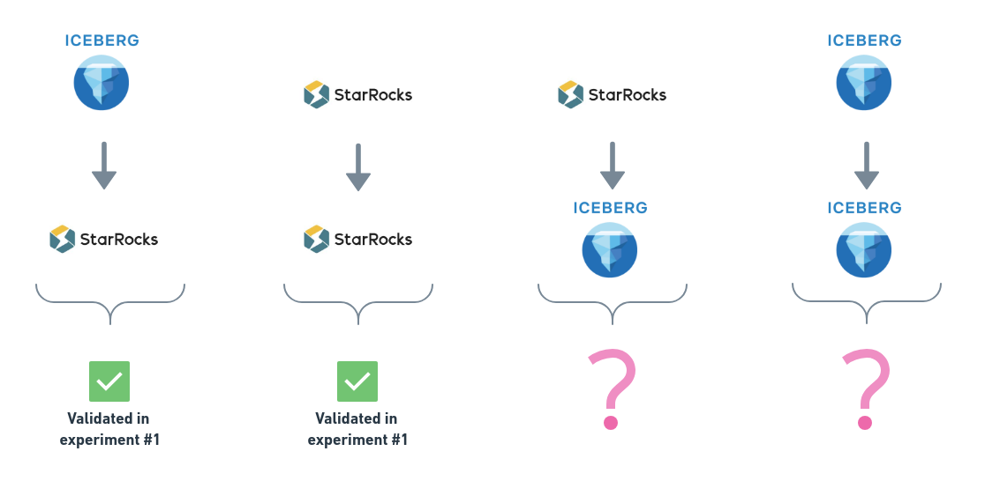
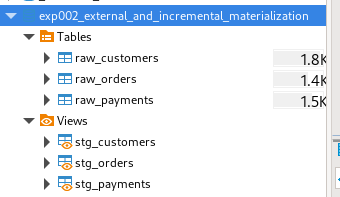
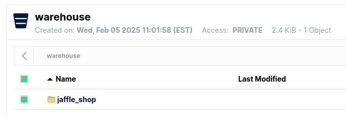

# Experimentation Journal: External materialization

## Experiment Metadata
- **Date Initiated:** 2025-02-05
- **Date Completed:** 2025-02-06
- **Related Issue number(s):** 
  - https://d3b.atlassian.net/browse/SJRA-42

## Background and Context

As part of the Radiant project, several key technologies were identified as good candidates to power the data platform.

The experiment therefore as the following constraints: 

- Use `dbt` to transform data.
- Use StarRocks as the data warehouse technology. 
- Leverage external Iceberg as the data lake format.

**Previous related experiments**
- [Experiment #1: External sources](001_dbt_starrock_external_iceberg_catalog_sources.md).

## Problem Statement

**Problem:**
- **Q1**: Can we materialize a table in the external catalog (i.e. Iceberg table) ? 

### Q1. External Materialization 

The following materialization pattern has been covered in [Experiment #1](001_dbt_starrock_external_iceberg_catalog_sources.md).

1. `starrocks` to `starrocks`: **OK** (Covered in [Experiment #1](001_dbt_starrock_external_iceberg_catalog_sources.md))
2. `iceberg` to `starrocks`: **OK** (Covered in [Experiment #1](001_dbt_starrock_external_iceberg_catalog_sources.md))
3. `starrocks` to `iceberg`: **??**
4. `iceberg` to `iceberg`: **??** 

Question **Q1** therefore covers items `3` and `4`.



## Experiment Design

### Methodology

Given the constraints and context, perform the following: 

1. Identify the source dataset.
2. Load the source data into a StarRocks table. 
3. Run `dbt build` (combination of `run` and `test`) to transform the data and test it.

#### Data flows

As part of the **Q1**, the following data flows will be modeled:

1. StarRocks --> Iceberg
2. Iceberg --> Iceberg (only if previous step is successful)

### Tools and Resources

#### Environment & Tools

Experimental files located in `radiant/experiments/dbt-runs/experiment_2`

The following diagram presents the local experimental setup.
> A `docker-compose.yml` file was used to specify required services. 


The experimental stack is composed of the following tech/tools: 

- `MinIO` (https://min.io/): Distributed object store.
- `Iceberg` (https://iceberg.apache.org/): Open table format.
- `StarRocks` (https://www.starrocks.io/): Analytical data warehouse.
- `dbt` (https://www.getdbt.com/): Data transformation. 

#### Data

Re-use a sample of the `dbt` tutorial's [Jaffle Shop data](https://github.com/dbt-labs/jaffle-shop?tab=readme-ov-file#-load-the-data-from-s3) as the raw data to be loaded into Iceberg tables.

We use the following files:

  - `raw_customers.csv`
  - `raw_orders.csv`
  - `raw_payments.csv`

## Observations

A replacement macro for `generate_schema_name` was necessary to make sure we can override the `schema` in the `dbt_project.yml` configuration.

```

    
        {{ target.schema }}
    
        {{ custom_schema_name | trim }}
    

```

Without this macro, `dbt` infers the following schema automatically: `exp002_external_materialization_iceberg` which is not what we need. This macro is located in the `experiment_2/macros` directory.

Then, to override the `schema` we need to set ip in the `dbt_profile.yml` (or in the model itself) like the following:

```
...
models:
  exp002_external_materialization:
    marts:
      materialized: table
      +schema: iceberg.jaffle_shop  # <-- Here!
...
```

**Logs**:

`dbt run` produced the following logs. 

```
16:03:43  Running with dbt=1.8.9
16:03:43  Registered adapter: starrocks=1.7.0
16:03:43  Found 5 models, 3 seeds, 20 data tests, 3 sources, 420 macros
16:03:43  
16:03:44  Concurrency: 1 threads (target='dev')
16:03:44  
16:03:44  1 of 5 START sql view model exp002_external_materialization.stg_customers  [RUN]
16:03:44  1 of 5 OK created sql view model exp002_external_materialization.stg_customers  [SUCCESS 0 in 0.20s]
16:03:44  2 of 5 START sql view model exp002_external_materialization.stg_orders  [RUN]
16:03:44  2 of 5 OK created sql view model exp002_external_materialization.stg_orders  [SUCCESS 0 in 0.11s]
16:03:44  3 of 5 START sql view model exp002_external_materialization.stg_payments  [RUN]
16:03:44  3 of 5 OK created sql view model exp002_external_materialization.stg_payments  [SUCCESS 0 in 0.11s]
16:03:44  4 of 5 START sql table model iceberg.jaffle_shop.customers ..................... [RUN]
16:06:47  4 of 5 OK created sql table model iceberg.jaffle_shop.customers ................ [SUCCESS 100 in 183.05s]
16:06:47  5 of 5 START sql table model iceberg.jaffle_shop.orders ........................ [RUN]
16:06:48  5 of 5 OK created sql table model iceberg.jaffle_shop.orders ................... [SUCCESS 99 in 0.53s]
16:06:48  
16:06:48  Finished running 3 view models, 2 table models in 0 hours 3 minutes and 4.43 seconds (184.43s).
16:06:48  
16:06:48  Completed successfully
16:06:48  
16:06:48  Done. PASS=5 WARN=0 ERROR=0 SKIP=0 TOTAL=5
```



Executing the following SQL on StarRocks:

```
SELECT * FROM iceberg.jaffle_shop.orders;
```

to confirm that the `iceberg` table was written and can be read again from StarRocks.

```
40	33	2018-02-13	completed	14.0	0.0	0.0	0.0	14.0
72	30	2018-03-14	shipped	29.0	0.0	0.0	0.0	29.0
87	46	2018-03-27	placed	26.0	0.0	0.0	30.0	56.0
31	16	2018-02-02	completed	12.0	0.0	0.0	0.0	12.0
(Truncated...)
```



However, running a second time, yields the following: 

```
18:22:44  Running with dbt=1.8.9
18:22:44  Registered adapter: starrocks=1.7.0
18:22:45  Unable to do partial parsing because change detected to override macro. Starting full parse.
18:22:46  [WARNING]: Deprecated functionality
The `tests` config has been renamed to `data_tests`. Please see
https://docs.getdbt.com/docs/build/data-tests#new-data_tests-syntax for more
information.
18:22:46  Found 5 models, 3 seeds, 20 data tests, 3 sources, 420 macros
18:22:46  
18:22:46  Concurrency: 1 threads (target='dev')
18:22:46  
18:22:46  1 of 5 START sql view model exp002_external_materialization.stg_customers  [RUN]
18:22:46  1 of 5 OK created sql view model exp002_external_materialization.stg_customers  [SUCCESS 0 in 0.21s]
18:22:46  2 of 5 START sql view model exp002_external_materialization.stg_orders  [RUN]
18:22:47  2 of 5 OK created sql view model exp002_external_materialization.stg_orders  [SUCCESS 0 in 0.17s]
18:22:47  3 of 5 START sql view model exp002_external_materialization.stg_payments  [RUN]
18:22:47  3 of 5 OK created sql view model exp002_external_materialization.stg_payments  [SUCCESS 0 in 0.13s]
18:22:47  4 of 5 START sql table model iceberg.jaffle_shop.customers ..................... [RUN]
18:22:47  4 of 5 ERROR creating sql table model iceberg.jaffle_shop.customers ............ [ERROR in 0.11s]
18:22:47  5 of 5 START sql table model iceberg.jaffle_shop.orders ........................ [RUN]
18:22:47  5 of 5 ERROR creating sql table model iceberg.jaffle_shop.orders ............... [ERROR in 0.04s]
18:22:47  
18:22:47  Finished running 3 view models, 2 table models in 0 hours 0 minutes and 0.89 seconds (0.89s).
18:22:47  
18:22:47  Completed with 2 errors and 0 warnings:
18:22:47  
18:22:47    Database Error in model customers (models/marts/customers.sql)
  1050 (42S01): Getting analyzing error. Detail message: Table 'customers' already exists.
  compiled code at target/run/exp002_external_materialization/models/marts/customers.sql
18:22:47  
18:22:47    Database Error in model orders (models/marts/orders.sql)
  1050 (42S01): Getting analyzing error. Detail message: Table 'orders' already exists.
  compiled code at target/run/exp002_external_materialization/models/marts/orders.sql
18:22:47  
18:22:47  Done. PASS=3 WARN=0 ERROR=2 SKIP=0 TOTAL=5
```

## Analysis

When functioning properly, `dbt` has the following sequence of operations:

_(Some steps were ignored because they are relevant to the point being made here)_

1. Fetches table information.
2. Rename (`alter table`) existing `customers` (or `orders`) to a backup table named `customers__dbt_backup`. 
3. Creates a new table named `customers__dbt_tmp` in which the new Customers model will be created.
4. Rename (`alter table`) existing `customers__dbt_tmp` into `customers`.
5. Drop `customers__dbt_backup` table which contains an earlier version of the newly created `customers` table.

However, in the current scenario pointing to `iceberg` schema, step **1** doesn't yield expected information.

The following query returns nothing, while it should return the existing table information:
```
    select
      null as "database",
      tbl.table_name as name,
      tbl.table_schema as "schema",
      case when tbl.table_type = 'BASE TABLE' then 'table'
           when tbl.table_type = 'VIEW' and mv.table_name is null then 'view'
           when tbl.table_type = 'VIEW' and mv.table_name is not null then 'materialized_view'
           when tbl.table_type = 'SYSTEM VIEW' then 'system_view'
           else 'unknown' end as table_type
    from information_schema.tables tbl
    left join information_schema.materialized_views mv
    on tbl.TABLE_SCHEMA = mv.TABLE_SCHEMA
    and tbl.TABLE_NAME = mv.TABLE_NAME
    where tbl.table_schema = 'iceberg.jaffle_shop'  # <-- Here!: tbl.table_schema should be `jaffle_shop` only. 
```

Following step **1**, step **2** is not executed (no presence of this in the logs) and therefore the existing `customers` table is never renamed into its backup `*_backup`.

This causes the downstream `create table` to fail because the table already exists.  

## Conclusion 

- **C1**: We can materialize to external catalog once. If we re-run `dbt run`, the process will fail. 
  - This is caused by `dbt-starrocks` not moving existing table into a backup table combined with the inability to correctly infer schema information.
  - This is due to a limitation of `dbt-starrocks` where external catalog is not supported by default for output.
  - It should be possible to achieve this by extending the `dbt-starrocks` plugin by updating existing macros or writing new macros to handle this specific case.

Therefore, configuration for writing to an external catalog is not supported out-of-the-box in `dbt-starrocks`.

## References

- [Experiment #1: External sources](001_dbt_starrock_external_iceberg_catalog_sources.md).
