# Experimentation Journal: Incremental materialization

## Experiment Metadata
- **Date Initiated:** 2025-02-06
- **Date Completed:** 2025-02-11
- **Related Issue number(s):** 
  - https://d3b.atlassian.net/browse/SJRA-42

## Background and Context

As part of the Radiant project, several key technologies were identified as good candidates to power the data platform.

The experiment therefore as the following constraints: 

- Use `dbt` to transform data.
- Use StarRocks as the data warehouse technology. 
- Leverage external Iceberg as the data lake format.

**Previous related experiments**
- [Experiment #1: External sources](001_dbt_starrock_external_iceberg_catalog_sources.md).
- [Experiment #2: External Materialization](002_dbt_starrock_external_materialization.md).

## Problem Statement

**Problem:**
- **Q1**: Is `incremental` supported out-of-the-box by `dbt-starrocks`?
- **Q2**: What happens when we update the schema (add/remove a column)?
- **Q3**: Can we use custom operations (insert+overwrite) when updating partitioned data?

## Experiment Design

### Methodology

#### Data Model

The following data model was implemented to validate the `incremental` materialization.

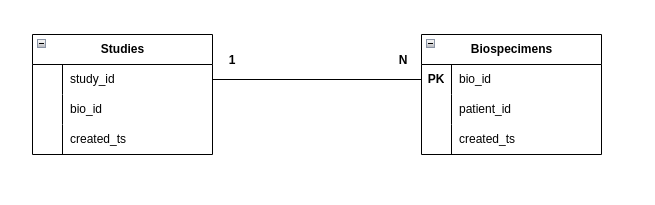

- A `study` can have `N` biospecimens.
- `biospecimens` are unique and are attached to a `patient_id`
- `patient_id` can be shared across `biospecimens` 

With the desired outcome of the experiment to produce a `patients` table with the following fields:

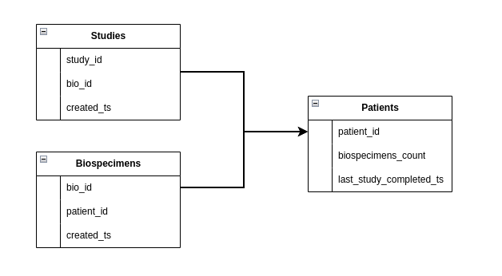

#### Data flows


### Tools and Resources

#### Environment & Tools

Experimental files located in `radiant/experiments/exp003`

The following diagram presents the local experimental setup.
> A `docker-compose.yml` file was used to specify required services. 

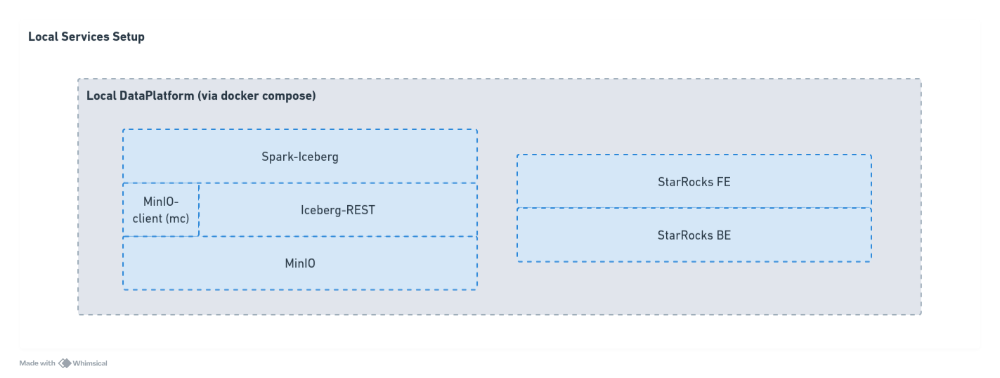

The experimental stack is composed of the following tech/tools: 

- `MinIO` (https://min.io/): Distributed object store.
- `Iceberg` (https://iceberg.apache.org/): Open table format.
- `StarRocks` (https://www.starrocks.io/): Analytical data warehouse.
- `dbt` (https://www.getdbt.com/): Data transformation. 
- `python` (https://www.python.org/): Used to build scripts to load the data.

#### Data Generation

For this experiment, a data generator script was implemented to allow creating new rows on the fly with the updated timestamp. 

This data generator is located in `experiment_3/raw_data/data_generator.py`. 

It generates data using the following schemas:

```
study_schema = {
    'study_id': str,
    'bio_id': str,
    'created_ts': int,
}

biospecimen_schema = {
    'bio_id': str,
    'patient_id': str,
    'created_ts': int,
}
```

## Observations

### Basic `incremental` materialization

1. Run `data_generator.py` to add initial data to your Iceberg tables.
2. Initial `dbt run` produces the following data:

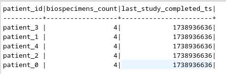

2. Run `data_generator.py` to add a new batch of data to Iceberg.

> **Note**:
>
> It's necessary to refresh the external catalog once data has been added, other StarRocks will not
> update its metadata correctly and will miss the new data.
> ```
> REFRESH EXTERNAL TABLE iceberg.exp003.studies;
> REFRESH EXTERNAL TABLE iceberg.exp003.biospecimens;
> ```

3. Second `dbt run` produces the following data:

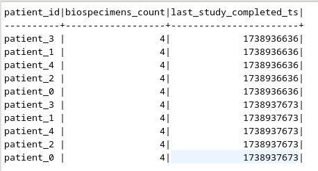

3. Full refresh: `dbt run --full-refresh` produces the following data:

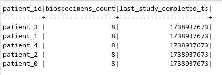

4. Run `data_generator.py` to add a new batch of data to Iceberg.

> **Note**:
> Don't forget to refresh the external catalog

5. Adding another batch of `studies` / `biospecimens` and running `dbt run` produces the following data:

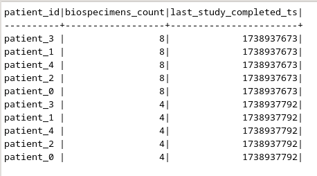

### Updated schema

To test the schema update operation, the following option was added to `patients.sql`:

```
on_schema_change='sync_all_columns'
```

With the updated `final` schema in `patients.sql`: 

```
'foobar' as new_column
```

We then get the following output:

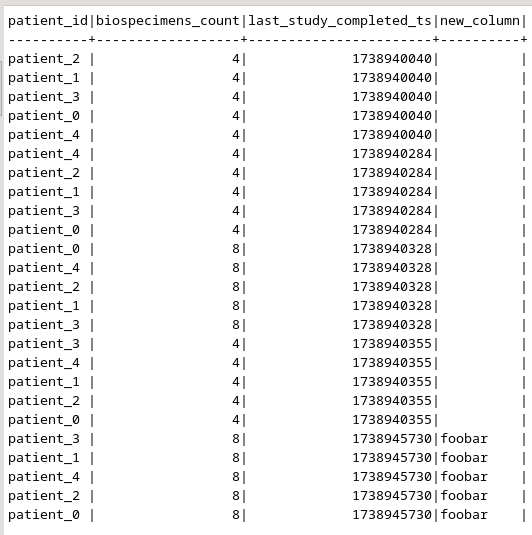

Logs show a schema change detected: 

```
14:25:44.163639 [debug] [Thread-1 (]: 
    In `expo003_incremental_materialization`.`patients`:
        Schema change approach: append_new_columns
        Columns added: [<StarRocksColumn new_column (varchar(1048576))>]
        Columns removed: 
        Data types changed: 
```

If we trigger a full-refresh from that point, we get: 

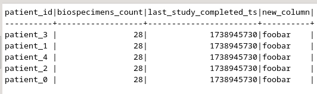

If we remove the `new_column` from the schema and re-run `dbt run` with a new batch of data:

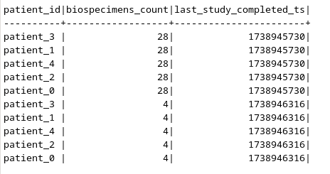

Another option `append_new_columns` was tested with an empty column and re-running the previous tests will yield the following table:

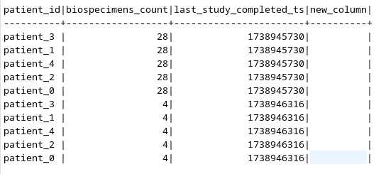

### Partitioned `incremental` materialization

Creating partitions is achieved through the following `dbt` sample configuration (other partitioning options exist https://docs.starrocks.io/docs/table_design/data_distribution/expression_partitioning/):

```
partition_type='Expr',
partition_by=['patient_id'],
```

Running `SHOW CREATE TABLE expo003_incremental_materialization.patients;` yields the following specification:

```sql
CREATE TABLE `patients` (
  `patient_id` varchar(1048576) NULL COMMENT "",
  `biospecimens_count` bigint(20) NOT NULL COMMENT "",
  `last_study_completed_ts` bigint(20) NULL COMMENT ""
) ENGINE=OLAP 
DUPLICATE KEY(`patient_id`)
PARTITION BY (`patient_id`)
DISTRIBUTED BY RANDOM
PROPERTIES (
"bucket_size" = "4294967296",
"compression" = "LZ4",
"fast_schema_evolution" = "true",
"replicated_storage" = "true",
"replication_num" = "1"
);
```

After running the first `dbt run` we can view the following partitions on the data from running: 

```sql
>>> SHOW PARTITIONS FROM expo003_incremental_materialization.patients;
10772	ppatient5f1	3	2025-02-11 18:09:11	0	NORMAL	patient_id	(('patient_1'))	ALL KEY	1	1	HDD	9999-12-31 15:59:59		1.8KB	false	2	3	338606889881305092	TXN_NORMAL
10757	ppatient5f4	3	2025-02-11 18:09:11	0	NORMAL	patient_id	(('patient_4'))	ALL KEY	1	1	HDD	9999-12-31 15:59:59		1.8KB	false	2	3	338606889881305089	TXN_NORMAL
10758	ppatient5f0	3	2025-02-11 18:09:11	0	NORMAL	patient_id	(('patient_0'))	ALL KEY	1	1	HDD	9999-12-31 15:59:59		1.8KB	false	2	3	338606889881305088	TXN_NORMAL
10762	ppatient5f2	3	2025-02-11 18:09:11	0	NORMAL	patient_id	(('patient_2'))	ALL KEY	1	1	HDD	9999-12-31 15:59:59		1.8KB	false	2	3	338606889881305090	TXN_NORMAL
10764	ppatient5f3	3	2025-02-11 18:09:11	0	NORMAL	patient_id	(('patient_3'))	ALL KEY	1	1	HDD	9999-12-31 15:59:59		1.8KB	false	2	3	338606889881305091	TXN_NORMAL
```

With the full data being: 

```
>>> SELECT * FROM expo003_incremental_materialization.patients p ORDER BY last_study_completed_ts;
patient_3	52	1736312400
patient_0	52	1736312400
patient_2	52	1736312400
patient_1	52	1736312400
patient_4	52	1736312400
```

Running an update (new data + new `dbt run`) on a partition results in the following data distribution: 

```
patient_3	52	1736312400
patient_0	52	1736312400
patient_2	52	1736312400
patient_1	52	1736312400
patient_4	52	1736312400
patient_1	8	1736485200
patient_4	8	1736485200
patient_0	8	1736485200
patient_3	8	1736485200
patient_2	8	1736485200
```

## Analysis

### Basic `incremental` materialization

The `materialized: incremental` 

> **Note**: This was tested for both `materialized: [view/table]` for staging models.

#### Executed SQL

First-run `sql` code: 

```
  create table `expo003_incremental_materialization`.`patients`
    PROPERTIES (
      "replication_num" = "1"
    )
  as 

with studies as (

    select * from `expo003_incremental_materialization`.`stg_studies`

    

),

biospecimens as (

    select * from `expo003_incremental_materialization`.`stg_biospecimens`

    

),

final as (

    select
        biospecimens.patient_id,
        count(distinct studies.bio_id) as biospecimens_count,
        max(studies.created_ts) as last_study_completed_ts

    from biospecimens

    left join studies on biospecimens.bio_id = studies.bio_id

    group by biospecimens.patient_id

)

select * from final
```

Second-run (incremental) `sql` code:

```
      insert into `expo003_incremental_materialization`.`patients` (`patient_id`, `biospecimens_count`, `last_study_completed_ts`)
    (
        select `patient_id`, `biospecimens_count`, `last_study_completed_ts`
        from `expo003_incremental_materialization`.`patients__dbt_tmp`
    )
```

Where `patients__dbt_tmp` is executed from: 

```
  create table `expo003_incremental_materialization`.`patients__dbt_tmp`
    PROPERTIES (
      "replication_num" = "1"
    )
  as 

with studies as (

    select * from `expo003_incremental_materialization`.`stg_studies`

    
        where created_ts > (select max(last_study_completed_ts) from `expo003_incremental_materialization`.`patients`)
    

),

biospecimens as (

    select * from `expo003_incremental_materialization`.`stg_biospecimens`

    
        where created_ts > (select max(last_study_completed_ts) from `expo003_incremental_materialization`.`patients`)
    

),

final as (

    select
        biospecimens.patient_id,
        count(distinct studies.bio_id) as biospecimens_count,
        max(studies.created_ts) as last_study_completed_ts

    from biospecimens

    left join studies on biospecimens.bio_id = studies.bio_id

    group by biospecimens.patient_id

)

select * from final
```

### Updated schema

> The current experiments evaluated in more details 2 different options `sync_all_columns` and `append_new_columns` (the other options were tested manually, but not described here in details for simplicity purposes).

Both behaviors yielded the expected tables. 

- `append_new_columns`: Append new columns to the existing table. Note that this setting does not remove columns from the existing table that are not present in the new data.
- `sync_all_columns`: Adds any new columns to the existing table, and removes any columns that are now missing. Note that this is inclusive of data type changes. On BigQuery, changing column types requires a full table scan; be mindful of the trade-offs when implementing.

#### Executed SQL

(From the previous `incremental` state)

```
    alter table `expo003_incremental_materialization`.`patients`

            
               add column new_column varchar(1048576)
```

```
      insert into `expo003_incremental_materialization`.`patients` (`patient_id`, `biospecimens_count`, `last_study_completed_ts`, `new_column`)
    (
        select `patient_id`, `biospecimens_count`, `last_study_completed_ts`, `new_column`
        from `expo003_incremental_materialization`.`patients__dbt_tmp`
    )
```

Where `patients__dbt_tmp` is executed from: 

```
eate table `expo003_incremental_materialization`.`patients__dbt_tmp`
    PROPERTIES (
      "replication_num" = "1"
    )
  as 

with studies as (

    select * from `expo003_incremental_materialization`.`stg_studies`

    
        where created_ts > (select max(last_study_completed_ts) from `expo003_incremental_materialization`.`patients`)
    

),

biospecimens as (

    select * from `expo003_incremental_materialization`.`stg_biospecimens`

    
        where created_ts > (select max(last_study_completed_ts) from `expo003_incremental_materialization`.`patients`)
    

),

final as (

    select
        biospecimens.patient_id,
        count(distinct studies.bio_id) as biospecimens_count,
        max(studies.created_ts) as last_study_completed_ts,
        'foobar' as new_column

    from biospecimens

    left join studies on biospecimens.bio_id = studies.bio_id

    group by biospecimens.patient_id

)

select * from final
```


For more information on schema change: [docs](https://docs.getdbt.com/docs/build/incremental-models#what-if-the-columns-of-my-incremental-model-change)

### Partitioned `incremental` materialization

Partitioning is managed through the `partition_by` and `partition_type` properties:

```
>>> partition_type='Expr',
>>> partition_by=['patient_id'],

...
10516	ppatient5f4 ...
10515	ppatient5f0 ...
10518	ppatient5f1 ...
10506	ppatient5f2 ...
10508	ppatient5f3 ...
```

**Insert Overwrite with `dbt-starrocks`**

- Out-of-the-box, there's no mention of `incremental_strategy` or `insert_overwrite` type configuration for `dbt-starrocks` plugin.
- Manually adding `incremental_strategy='insert_overwrite'` (like what is described [here](https://docs.getdbt.com/docs/build/incremental-strategy)) yields:

```
The incremental strategy 'insert_overwrite' is not valid for this adapter
```

Enabling the `insert_overwrite` strategy would require custom macros to be implemented. 
It would also enable using the new [Dynamic Overwrite](https://docs.starrocks.io/docs/loading/InsertInto/#dynamic-overwrite) option (new in 3.4)

**What happens when there's an update to a partition?**

First, `dbt` creates a `__tmp` table with the same partitioning scheme as the real table:

```sql
create table `expo003_incremental_materialization`.`patients__dbt_tmp`PARTITION BY patient_id
```

Then it `insert(s)` the data from the `__tmp` table to the real table:

```
insert into `expo003_incremental_materialization`.`patients` (`patient_id`, `biospecimens_count`, `last_study_completed_ts`)
(
    select `patient_id`, `biospecimens_count`, `last_study_completed_ts`
    from `expo003_incremental_materialization`.`patients__dbt_tmp`
)
```


## Conclusion 

- **C1**: `incremental` materialization is supported out-of-the-box in `dbt-starrocks`. (See [Observations: Basic incremental materialization](#basic-incremental-materialization))
- **C2**: Different options for schema change are supported out-of-the-box in `dbt-starrocks` (See [Observations: Updated schema](#updated-schema))
- **C3**: `insert_overwrite` (Insert+Overwrite mode) is not supported out-of-the-box and would require custom macros to be implemented.

## References

- [Experiment #1: External sources](001_dbt_starrock_external_iceberg_catalog_sources.md)
- [Experiment #2: External Materialization](002_dbt_starrock_external_materialization.md)
- [dbt-starrocks (Github)](https://github.com/StarRocks/dbt-starrocks?tab=readme-ov-file#supported-features)
- [dbt `on_schema_change`](https://docs.getdbt.com/docs/build/incremental-models#what-if-the-columns-of-my-incremental-model-change)
- [StarRocks Expression Partitioning](https://docs.starrocks.io/docs/table_design/data_distribution/expression_partitioning/)