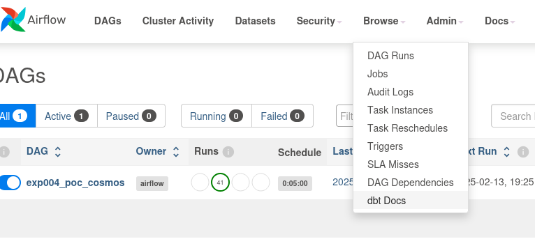

# Experimentation Journal: Airflow + Cosmos

## Experiment Metadata
- **Date Initiated:** 2025-02-12
- **Date Completed:** 2025-02-13
- **Related Issue number(s):** 
  - n/a

## Background and Context

As part of the Radiant project, several key technologies were identified as good candidates to power the data platform.

The experiment therefore as the following constraints: 

- Use `dbt` to transform data.
- Use StarRocks as the data warehouse technology. 
- Use `airflow` to schedule workflows.

**Previous related experiments**
- [Experiment #1: External sources](001_dbt_starrock_external_iceberg_catalog_sources.md).
- [Experiment #2: External Materialization](002_dbt_starrock_external_materialization.md).
- [Experiment #3: Incremental Materialization](003_dbt_starrock_incremental_materialization.md).

## Problem Statement

**Problem:**
- **Q1**: Does [cosmos](https://github.com/astronomer/astronomer-cosmos/) (airflow plugin for `dbt`) works out-of-the-box?

## Experiment Design

### Methodology

#### Data

The dataset used for this experiment is the [TP53 Tumor Variants](https://tp53.cancer.gov/get_tp53data#get_som_mut). 

It contains the following files: 

- Tumor variants in human tumor samples (data file) 		
- Tumor variants in human tumor samples (references file) 		
- Prevalence of tumor variants by tumor site 		
- Prevalence of the R249S TP53 variants in liver cancer 		
- Prognostic value of tumor variants

A Python script was developed to load the TP53 dataset into an `iceberg` table.
It's located at `.../exp004/load_raw_data_into_iceberg.py`.

> **Note**:
> 
> Make sure the `iceberg` catalog is created prior to running the script.
>
> If not, run `make create-iceberg-catalog` from the `experiments` directory.

Running it should produce the following tables in the `iceberg.exp004` catalog:

```
>>> SHOW TABLES FROM iceberg.exp004;
PrevalenceDownloadR249S_r21
PrevalenceDownload_r21     
PrognosisDownload_r21      
TumorVariantDownload_r21   
TumorVariantRefDownload_r21
```

### Tools and Resources

#### Environment & Tools

Experimental files located in `radiant/experiments/exp004`

The following diagram presents the local experimental setup.

> **Note**:
> 
> The `docker-compose.yml` file used to deploy the services is located at `.../exp004/docker-compose.yml`
>
> Make sure to build the custom docker image containing the `dbt-starrocks` dependency 
prior to running the `make airflow-run` command. 
> 
> You can spin-up the services by running `make airflow-run`


#### Cosmos workflow

The `.../exp004/dags/dbt_build_dag.py` python file contains the `cosmos` DAG. 

It's not required to manually run this script as it will be loaded automatically when `airflow` starts. 

You can validate the DAG was correctly loaded by opening the airflow dashboard: 


## Observations

- Once correctly configured, the `exp004_poc_cosmos` is detected automatically by `airflow`.
- The `Graph` tab view shows the mod


#### `dbt docs`

The docs are available through the `Browse` menu tab.



#### Execution logs


## Analysis

`cosmos` extracts the different models from the `dbt` project configuration and does the following: 

1. Split each model into a `.run` and `.test` tasks


2. Each task is then ran in isolation. Example for the `stg_prevalence` model:

   - For `run`:
    ```
     ['/opt/***/dbt_venv/bin/dbt', 'run', '--models', 'stg_prevalence', '--project-dir', '/tmp/tmpo1bd4x31', '--profiles-dir', '/opt/***/dbt', '--profile', 'starrocks_profile', '--target', 'dev']
    ```

   - For `test`:

    ```
     ['/opt/***/dbt_venv/bin/dbt', 'test', '--models', 'stg_prevalence', '--project-dir', '/tmp/tmp4a2u8i8l', '--profiles-dir', '/opt/***/dbt', '--profile', 'starrocks_profile', '--target', 'dev']
    ```

## Conclusion 

- **C1**: `cosmos` plugin was tested for DAG execution and docs generation. These feature works out-of-the-box. 

> **Note**:
> 
> More advanced features of cosmos were not tested as part of the POC. 

## References

- [Experiment #1: External sources](001_dbt_starrock_external_iceberg_catalog_sources.md)
- [Experiment #2: External Materialization](002_dbt_starrock_external_materialization.md)
- [Experiment #3: Incremental Materialization](003_dbt_starrock_incremental_materialization.md)
- [cosmos](https://github.com/astronomer/astronomer-cosmos/)
- [TP53 Dataset](https://tp53.cancer.gov/)